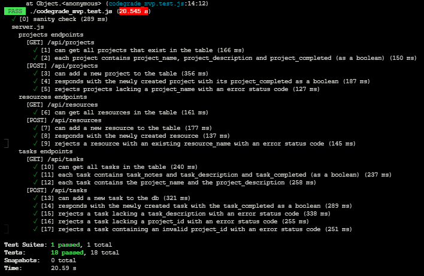

```

  at Object.<anonymous> (codegrade_mvp.test.js:14:12)
 PASS  ./codegrade_mvp.test.js (20.545 s)
  ✓ [0] sanity check (289 ms)
  server.js
    projects endpoints
      [GET] /api/projects
        ✓ [1] can get all projects that exist in the table (166 ms)
        ✓ [2] each project contains project_name, project_description and project_completed (as a boolean) (150 ms)
      [POST] /api/projects
        ✓ [3] can add a new project to the table (356 ms)
        ✓ [4] responds with the newly created project with its project_completed as a boolean (187 ms)
        ✓ [5] rejects projects lacking a project_name with an error status code (127 ms)
    resources endpoints
      [GET] /api/resources
        ✓ [6] can get all resources in the table (161 ms)
      [POST] /api/resources
        ✓ [7] can add a new resource to the table (177 ms)
        ✓ [8] responds with the newly created resource (137 ms)
        ✓ [9] rejects a resource with an existing resource_name with an error status code (145 ms)
    tasks endpoints
      [GET] /api/tasks
        ✓ [10] can get all tasks in the table (240 ms)
        ✓ [11] each task contains task_notes and task_description and task_completed (as a boolean) (237 ms)
        ✓ [12] each task contains the project_name and the project_description (258 ms)
      [POST] /api/tasks
        ✓ [13] can add a new task to the db (321 ms)
        ✓ [14] responds with the newly created task with the task_completed as a boolean (289 ms)
        ✓ [15] rejects a task lacking a task_description with an error status code (338 ms)
        ✓ [16] rejects a task lacking a project_id with an error status code (255 ms)
        ✓ [17] rejects a task containing an invalid project_id with an error status code (251 ms)

Test Suites: 1 passed, 1 total
Tests:       18 passed, 18 total
Snapshots:   0 total
Time:        20.59 s

```


